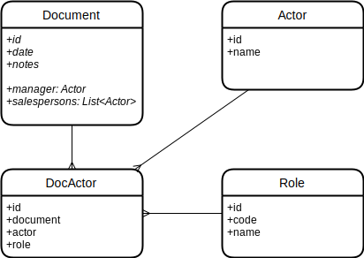

# Transient Attributes Demo

This project demonstrates usage of transient attributes in a JPA entity to handle relationships of the following kind:

Here the `manager` and `salespersons` attributes of the `Document` entity have no direct references to the `Actor` entity in the database. Instead, they are related through the `DocActor` entity: 

- For `manager`, there is a record in `DocActor` with reference to an `Actor` and the `Role` with `manager` code.
- For `salespersons`, there are records in `DocActor` with references to `Actor` and the `Role` with `salesperson` code.

The `manager` and `salespersons` transient attributes are displayed in the `Document` edit screen. They are loaded in the load delegate of the `documentDl` loader and saved in commit delegate. See the implementation in [DocumentEdit.java](src/main/java/com/company/demo/screen/document/DocumentEdit.java).
